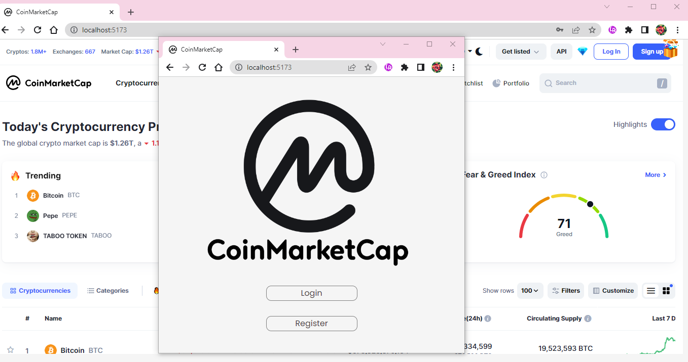

# React + Vite

# MVC -Formik - CoinMarketCap

_MVC ( Model View Controller)_
MVC stands for Model-View-Controller, and it is a design pattern that separates the logic, presentation, and interaction of a software application. The model is the data layer that represents the state and business rules of the application. The view is the user interface layer that displays the data and receives user input. The controller is the logic layer that handles the communication between the model and the view, and executes the actions requested by the user.

## MVC ( Model View Controller)

- Model, MVC’de projenin iş mantığının (business logic) oluşturulduğu bölümdür. İş mantığıyla beraber doğrulama (validation) ve veri erişim (data access) işlemleri de bu bölümde gerçekleştirilmektedir.
- View, MVC’de projenin arayüzlerinin oluşturulduğu bölümdür. Bu bölümde projenin kullanıcılara sunulacak olan HTML dosyaları yer almaktadır.
- Controller, MVC’de projenin iç süreçlerini kontrol eden bölümdür. Bu bölümde View ile Model arasındaki bağlantı kurulur. Kullanıcılardan gelen istekler (request) Controller’larda değerlendirilir, isteğin detayına göre hangi işlemlerin yapılacağı ve kullanıcıya hangi View’ın döneceği (response) belirtilir.

# Kütüphaneler

- Formik
- Axios
- React-router-dom
- React-icons
- Yup
- Uuid
- React-chartjs-2

# API : https://api.coincap.io/v2/assets

## Preview

# MVC_Project-Formik-CoinMarketCap
